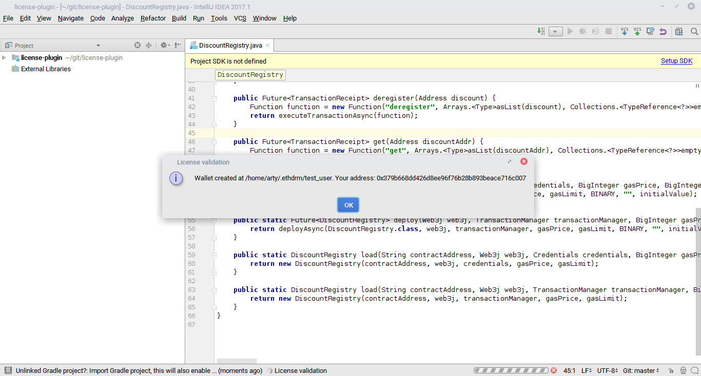

## Description  
Plugin for IntelliJ IDEA. Showcase for ethdrm smart contract.

## Requirements  
* IntelliJ IDEA (2016.2 and higher)
* Java 8
* Gradle  

## Usage  
Simply run 'gradle runIde' in project directory.

## Screenshots  

## Known issues  
* license validation task won't end
  until block with transaction is mined
* created account doesn't have any ether 
  (will be fixed when ropsten faucet starts work again)